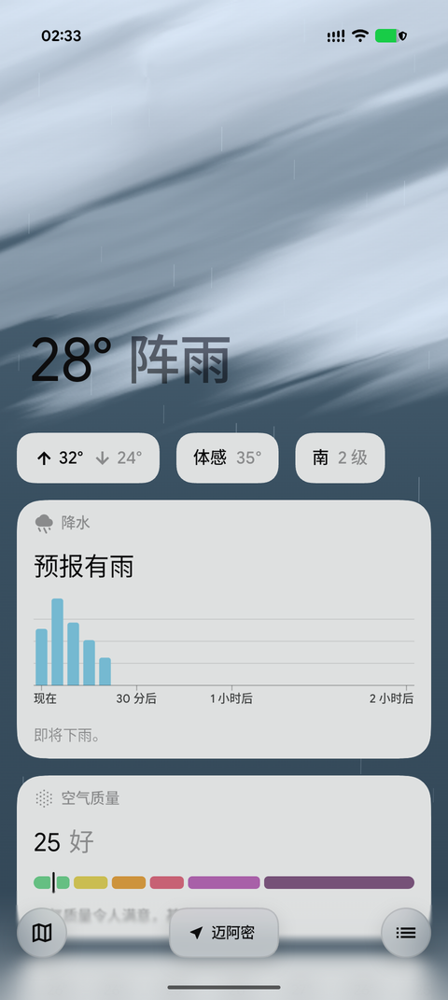
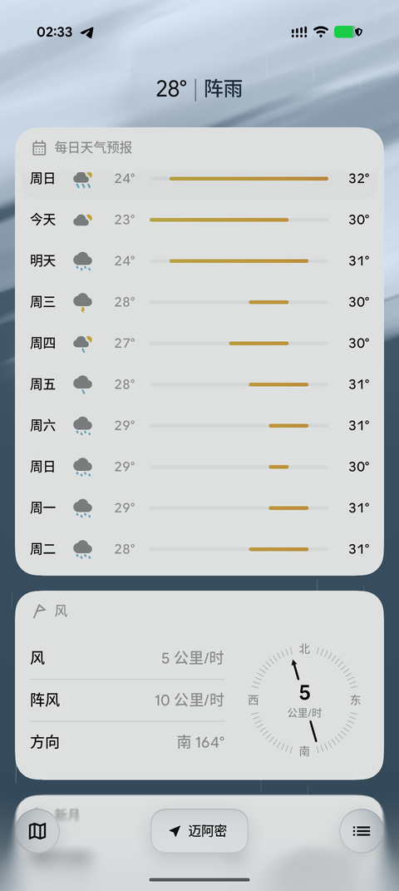
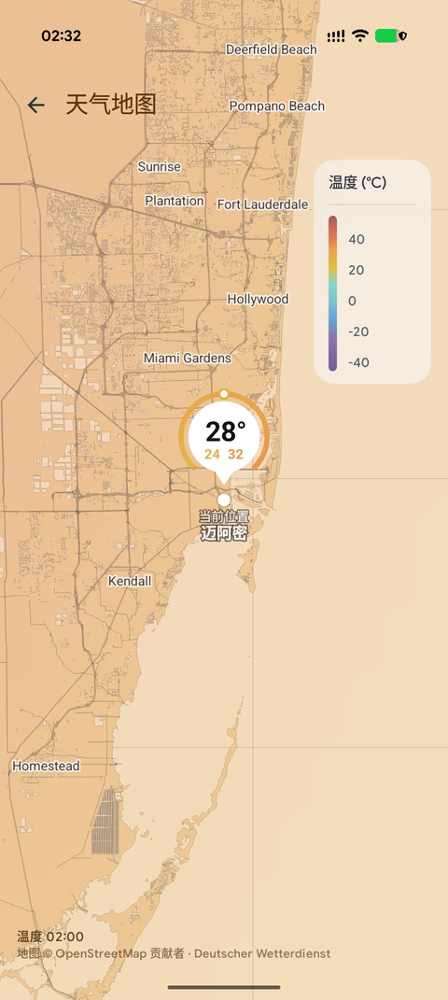
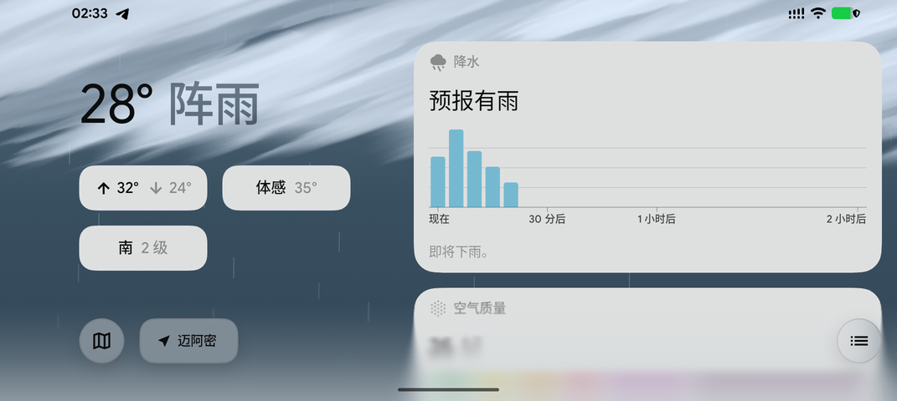

# Weather

A native Android weather app, written in Kotlin with Jetpack Compose. The sky behind the
page is drawn live by a shader that follows the weather and the sun; the cards on it are
Material 3 glass. Data comes from the [FundamentalOS](https://fundamentalos.org) backend.

<p align="center">
  
  
  
</p>
<p align="center">
  
</p>

## What it does

- **Now, at a glance.** Temperature and conditions in a headline that shrinks into a title
  bar as the page scrolls; today's range, the feel and the wind as chips under it.
- **The next day and the days after.** Twenty-four hours ahead, a daily outlook, and a
  minute-by-minute precipitation curve for the coming hour when the backend has one.
- **Details.** Air quality, wind with gusts, the moon's phase, sunrise and sunset on an arc,
  UV, feels-like, humidity with dew point, visibility, and pressure on a gauge.
- **Weather warnings** for the place, coloured by severity.
- **A live sky.** On Android 13 and later the background is an AGSL shader: clouds that
  drift, a sun that moves with the real solar position, stars that twinkle at night,
  lightning in a storm, and a 3.5-second blend when the weather changes. Older devices get
  a Canvas rendering of the same palette.
- **A weather map.** A temperature field over a map drawn from OpenStreetMap vector tiles,
  with the home place marked by its temperature and today's range.
- **Places.** Your device's location, or any place found by name; saved places are a tap
  away in the list behind the bar at the foot of the page.
- **Sideways, too.** In landscape the headline and chips stand still at the left and the
  cards scroll at the right, the way Apple Weather lays it out.
- **Six languages:** English, German, French, Polish, Russian and Chinese, selectable per
  app on Android 13 and later.

Settings let you freeze the background animation, turn off the glass text, and turn off the
IP-based location fallback.

## Where the data comes from

The app talks only to the FundamentalOS API (`https://api.fundamentalos.org`), which
aggregates its sources server-side and returns one snapshot per place: current conditions,
hourly and daily forecasts, air quality, minute-by-minute precipitation and warnings, in
the app's language. The credits shown in the app's *Data sources* screen:

| What | Source |
|---|---|
| Forecast and air quality | [Open-Meteo](https://open-meteo.com) |
| Place names and search | [GeoNames](https://www.geonames.org) |
| IP geolocation | [DB-IP Lite](https://db-ip.com) |
| Map | [OpenStreetMap](https://www.openstreetmap.org) vector tiles |
| Temperature field on the map | The backend's map layers, credited as they report themselves (currently Deutscher Wetterdienst) |
| Moon texture | NASA / GSFC / Arizona State University |
| Icons | Material Symbols |

The backend is a separate project; this repository is the Android client only.

**Location.** The app asks the system for a fix (GPS, network, passive, last known) and,
until one arrives or when none does, asks the backend to place the device by its IP address.
That fallback can be turned off in settings. The backend receives coordinates to fetch
weather for, and the text of a place search; there is no account and no analytics.

## Building

You need a JDK 17 or newer and the Android SDK (compile SDK 37). A current Android Studio
opens the project directly; on the command line:

```bash
git clone https://github.com/FundamentalApps/Weather.git
cd Weather
./gradlew assembleDebug        # app/build/outputs/apk/debug/app-debug.apk
./gradlew installDebug         # onto a connected device
```

Clone with history and tags: the version code is the commit count on the first-parent
line and the version name comes from the latest `v*` tag, so a shallow clone or a source
tarball will not build.

`local.properties` (not committed) may set `app.fosApiBaseUrl` to point the app at another
FundamentalOS API base URL, such as a local development server. It defaults to
`https://api.fundamentalos.org`.

The app needs Android 7.0 (API 24) or later. The shader sky, the glass text and per-app
language need Android 13.

## License

[GNU General Public License v3](LICENSE).
