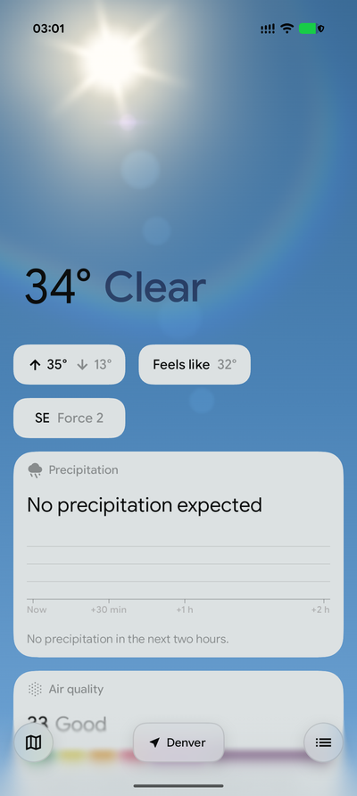
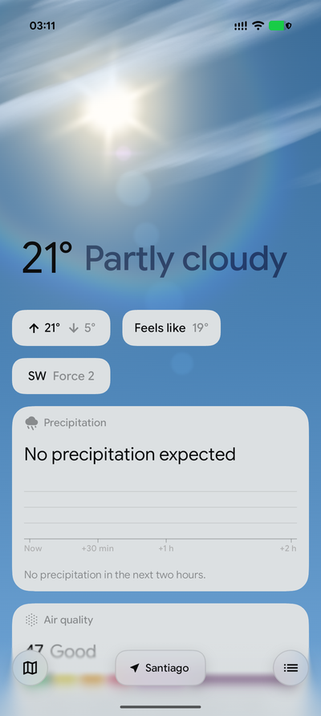
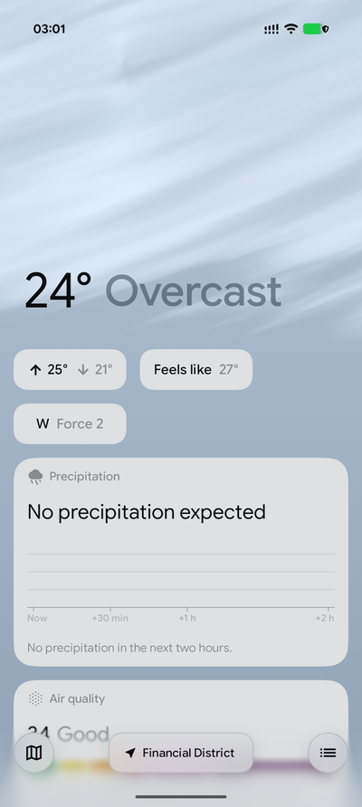
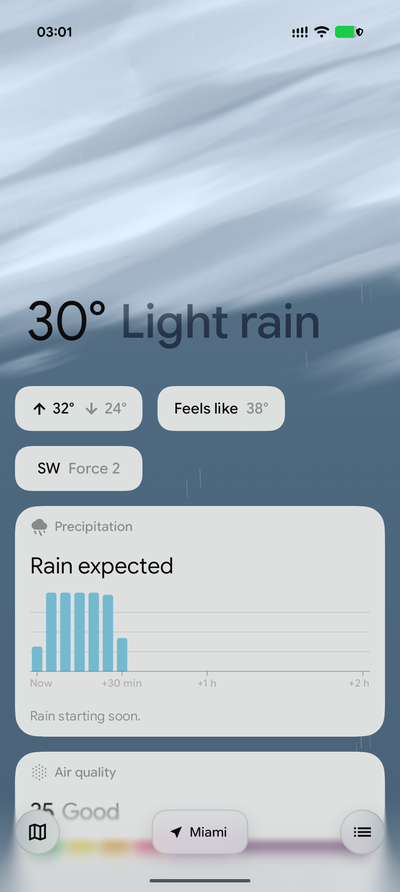
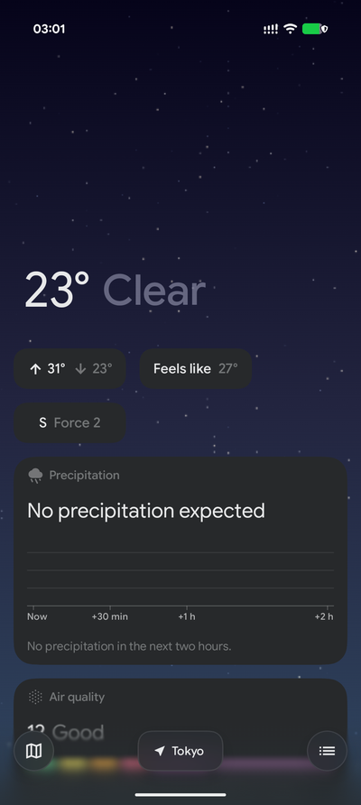

## Weather

A native Android weather app, written in Kotlin with Jetpack Compose.

<p align="center">
  
  
  
  
  
</p>
<p align="center">
  
  
</p>


## Features

- **Details.** Air quality, wind with gusts, the moon's phase, sunrise and sunset on an arc,
  UV, feels-like, humidity with dew point, visibility, and pressure on a gauge.
- **Weather warnings** for the place, coloured by severity.
- **A weather map.** A temperature field over a map drawn from OpenStreetMap vector tiles,
  with the home place marked by its temperature and today's range.
- **Places.** Your device's location, or any place found by name. Saved places are a tap
  away in the list behind the bar at the foot of the page.

## Data sources

| What | Source |
|---|---|
| Forecast and air quality | [Open-Meteo](https://open-meteo.com) |
| Place names and search | [GeoNames](https://www.geonames.org) |
| IP geolocation | [DB-IP Lite](https://db-ip.com) |
| Map | [OpenStreetMap](https://www.openstreetmap.org) vector tiles |
| Temperature field on the map | The backend's map layers, credited as they report themselves (currently Deutscher Wetterdienst) |
| Moon texture | NASA / GSFC / Arizona State University |
| Icons | Material Symbols |

The backend is a separate project. This repository is the Android client only.

## Building

You need a JDK 17 or newer and the Android SDK (compile SDK 37). A current Android Studio
opens the project directly; on the command line:

```bash
git clone https://github.com/FundamentalApps/Weather.git
cd Weather
./gradlew assembleDebug        # app/build/outputs/apk/debug/app-debug.apk
./gradlew installDebug         # onto a connected device
```

The app needs Android 7.0 (API 24) or later. The shader sky, the glass text and per-app
language need Android 13.

## License

[GNU General Public License v3](LICENSE).

## FundamentalOS relations

This app's main goal is to replace Google's weather apps and serves as a provider for SystemUIFundamental's BcSmartspace weather information. Please check the patches in the main organization.
